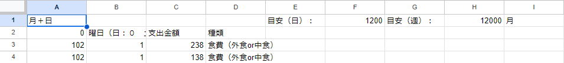

# kakeibo_with_gas
- SpreadSheet,GoogleFormによる家計簿
- 自分用のバックアップ的なリポジトリ
- .gsファイルを無理やり.jsファイルにしている

# 記録の流れ
1. Googleフォームで以下を入力
    - 今日or昨日
    - 使った金額(半角数字のみ)
    - その種別
1. 入力内容を整形しスプレッドシートへ記入 
    - setResponses.js
1. スプレッドシートの内容をもとに，日ごと，週ごと，月ごとに支出を計算
    - CulcPerDay.js
    - CulcPerWeek.js
    - CulcPerMonth.js
1. 週ごと，月ごとの記録をメールで送信
1. 月ごとのまとめを別シートに記入 

# Googleフォーム

# スプレッドシート
